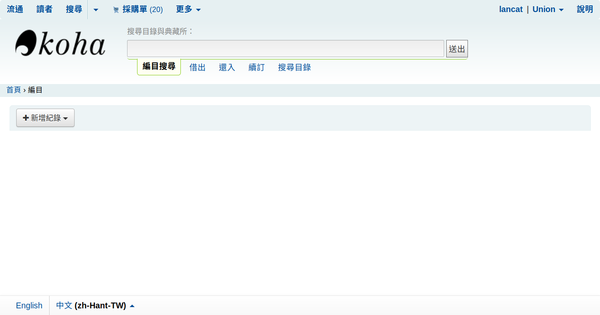
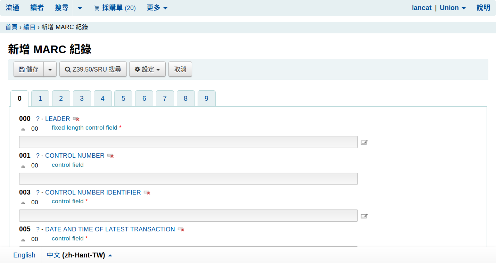
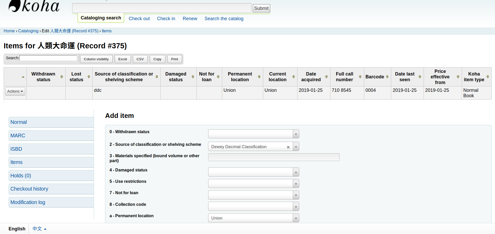
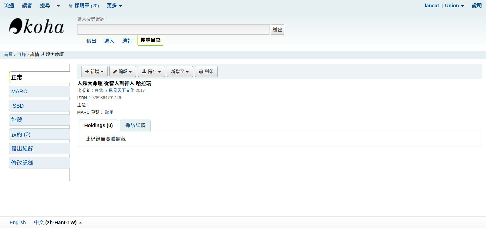

# 編目與館藏

## 編目與館藏之別

編目（Catalog）是圖書館紀錄一本書的資料，同一本書只會有一筆編目資料；館藏（Item）是在圖書館中的書的資料，一本館藏依賴於一個編目資料，一個編目可以有多本館藏，只有館藏可以被借還書。

編目資料使用 MARC 編目格式儲存，紀錄書名、作者、出版社、ISBN 等等的資料。館藏資料則是紀錄在哪個分館、索書號（Call Number）、登錄號（Barcode）。

## 單筆新增編目

先進入 更多 / 編目（More / Cataloging），點選**新增紀錄（add record）**，然後選擇框架，先選擇預設框架。

我們開始在指定欄位填入資料

* ISBN：020$a

* 標題：245$a

* 副標題：245$b

* 作者：245$c

* 出版地：260$a

* 出版社：260$b

* 出版日期：260$c

* 集叢名：490$a

* 標籤：650$a

* 館藏類型：942$c

  001 系統控制號
  010 國際標準書號(ISBN)\$a國際標準書號
  011 國際標準叢刊號(ISSN)  \$a國際標準叢刊號
  013 國際標準樂譜號(ISMN) \$a際標準樂譜號
  015 國際標準技術報告號碼(ISRN) \$a國際標準技術報告號碼
  100 一般資料 \$a一般性資料
  101 作品語文
  200 題名及著者敘述項 \$a正題名 $f第一著者敘述
  205 版本項 $a版本敘述
  206 207 208 230 資料特殊細節項 [略過不處理]
  210 出版項 \$c出版者 \$d出版年
  215 稽核項 \$a數量(面、葉、冊數或其他單位)
  300 一般註 \$a附註
  327 內容註 \$a附註
  328 學位論文註 \$a附註
  330 摘要註 $a附註
  801 出處欄

填寫完畢後，點按**儲存並編輯館藏（Save and Edit items）**加入一筆館藏紀錄。

館藏紀錄須填入下列資料：

* 2 - Source of classification or shelving scheme：分類法
* Permanent location：主要分館
* Current location：現在所在分館
* Full call number：索書號
* Barcode：登錄號
* Koha Item type：Koha 中的館藏類型

然後按下儲存即可新增一筆館藏紀錄

# 參考資料

[MARC 21 欄位對應 RDA](http://klkly23.pixnet.net/blog/post/176271744-%E8%B3%87%E8%A8%8A%E7%B5%84%E7%B9%94-%E5%8F%83%E8%B3%87marc-21%E6%AC%84%E4%BD%8D%E5%B0%8D%E6%98%A0rda)

[Koha Manual - Cataloging]()

[Koha 圖書館員手冊](http://lins.fju.edu.tw/mao/koha/libraiansmanual.html)

