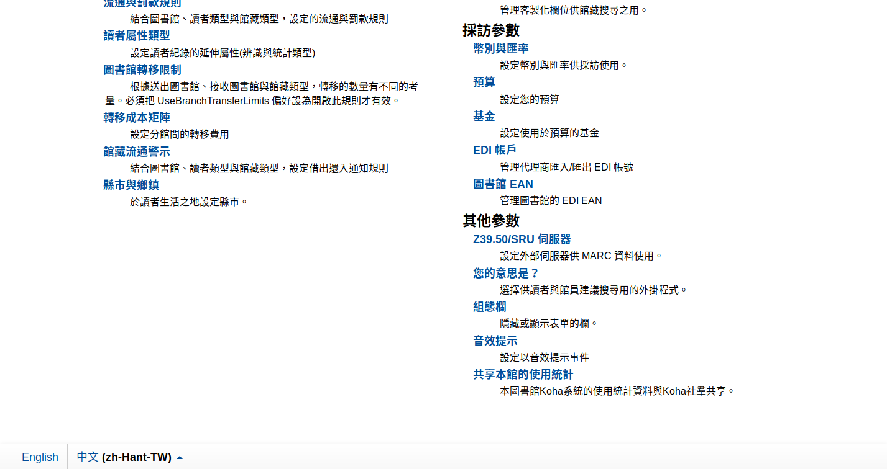
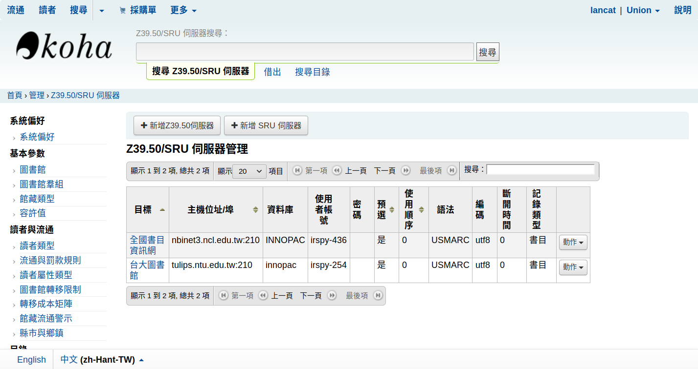
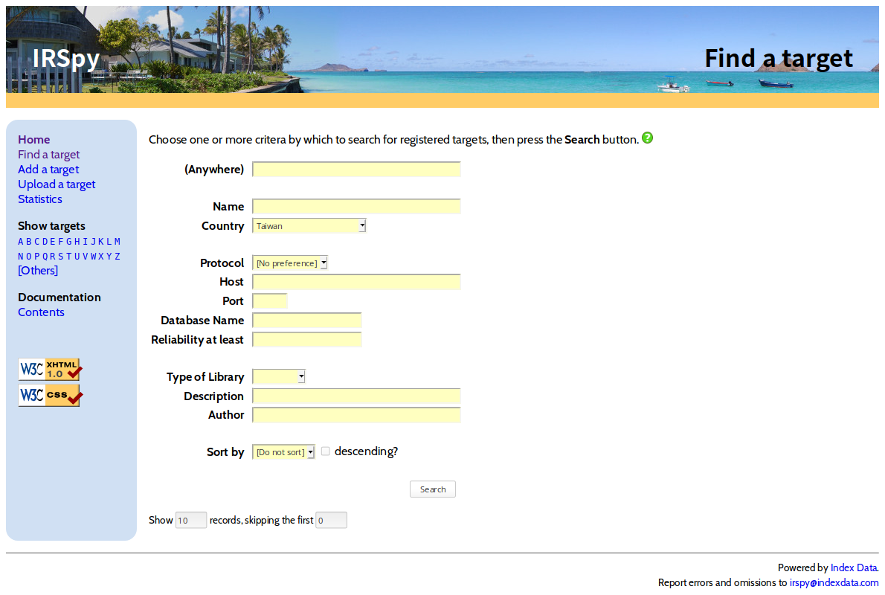
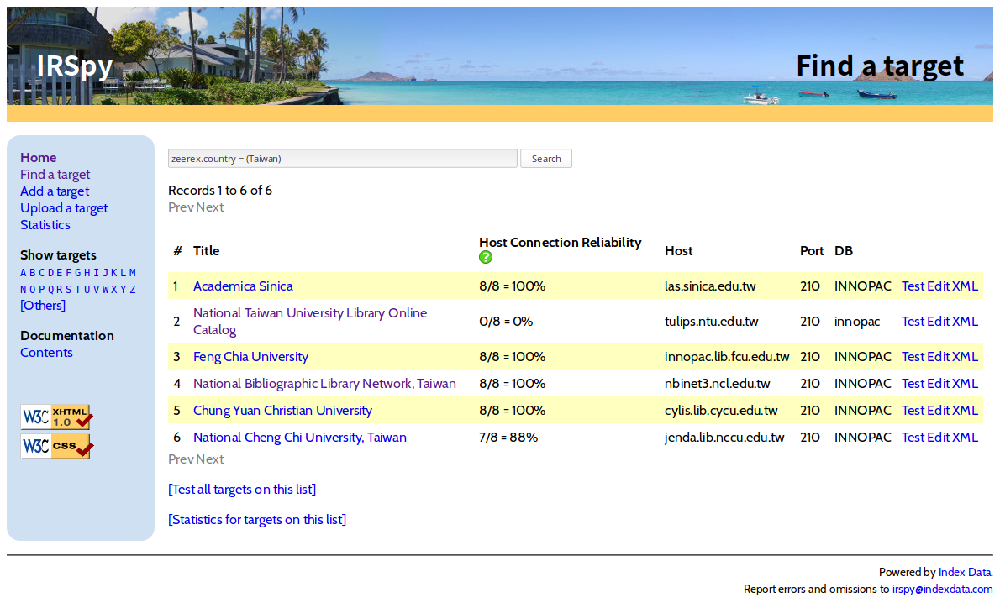
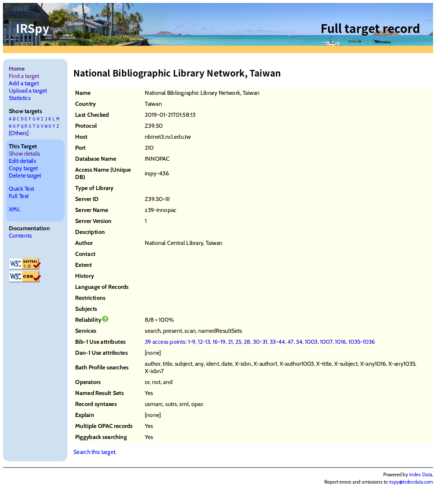
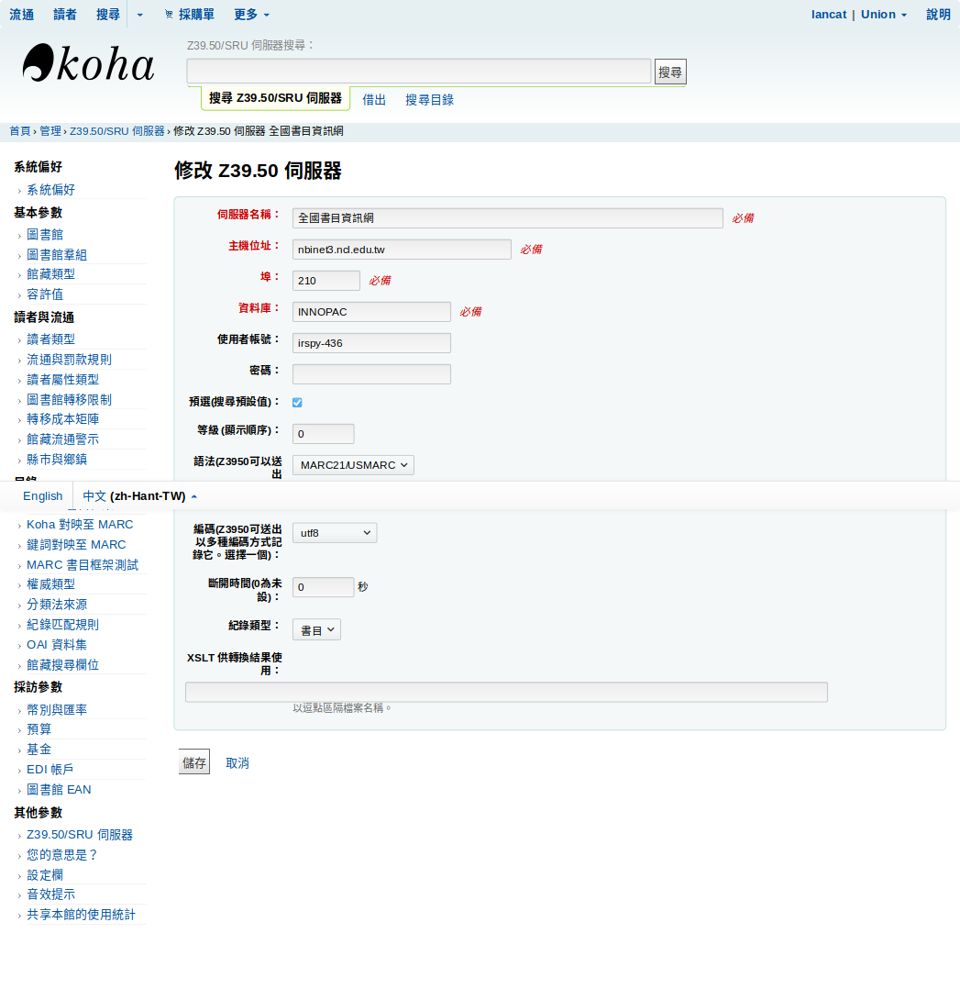

# 圖書館設定

以下將羅列 Koha 所需調整各個設定。

## 加入 Z39.50 目標 （Z39.50 Targets）

首先進到 **管理（administration）**，進入 **其他參數 — Z39.50/SRU 伺服器**。可以看到現有的外部標的，預設是 0。

這時候我們點選 **新增 Z39.50 伺服器**，開始輸入資料。現有的 Z39.50 伺服器資料可以到 [IRSpy](http://irspy.indexdata.com/find.html) 網站做查詢，我們在這裡搜尋台灣的圖書館。

我們以 [全國書目資訊網]() 作為範例，將資料輸入欄位中。（註：由於截圖是以成功新增後按編輯拍攝，所以會和新增有些許不同）

按下儲存後，即可在編目時查詢該圖書館資料。